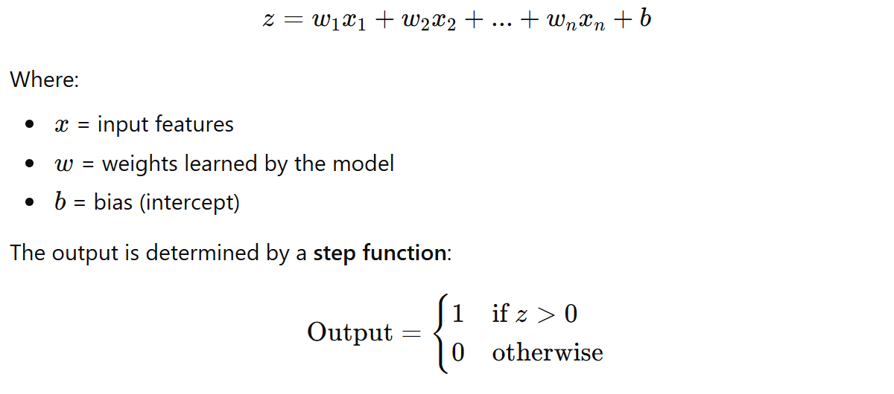

## What is a Perceptron

A Perceptron is one of the simplest machine learning algorithms and is considered the basic building block of neural networks. It is a binary classifier, meaning it predicts one of two classes (for example: 0 or 1).

The perceptron takes several input features, multiplies each feature by a weight, sums them together, and then applies a decision rule to determine the output.

Mathematically:

​

The perceptron learns by adjusting the weights whenever it makes a wrong prediction.

## Key Properties of Perceptron:

Works for binary classification problems

Creates a linear decision boundary

Learns weights using an iterative update rule

Only works well if the data is linearly separable

## Decision Boundary

The perceptron separates classes using a straight line (in 2D) or hyperplane (in higher dimensions).

Example decision boundary:
w1​x1​+w2​x2​+b=0

Points on one side of the line belong to one class, while points on the other side belong to the other class.

What We Did in This Notebook

In this notebook, we built a Perceptron-based classifier to predict student placement using two features:

CGPA

Resume Score

Steps performed:

Loaded the dataset using Pandas

Visualized the data using Seaborn scatter plot

Selected input features (cgpa, resume_score) and the target label (placed)

Trained a Perceptron model using scikit-learn

Extracted the learned weights and bias

Visualized the decision boundary using plot_decision_regions

The model learns a line that separates students who were placed vs not placed based on their CGPA and resume score.
